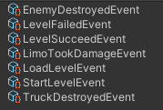
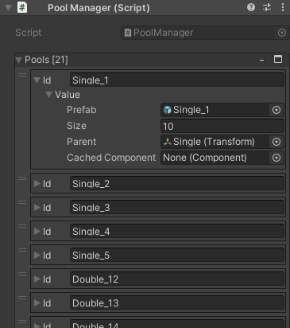
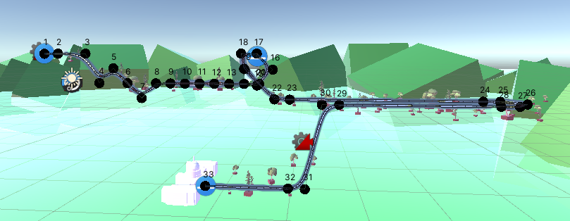
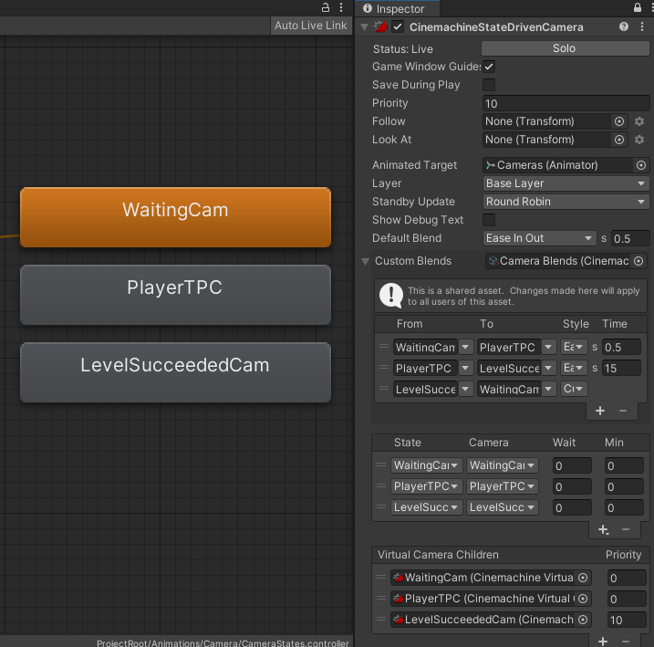

# President Motorcade
This is a display repository for my private project named "PresidenMotorcade".
## Preview of Game
We are Leading a motor that protects President

## Used Technologies

### ScriptableObjects for event system

---
### ObjectPools for spawning enemies/environment objects

---
### Splines for Level creation and Player movement

---
### CinemachineStateDrivenCamera as camera management with Animation States

## Credits
[DreamteckSplines](https://assetstore.unity.com/packages/tools/utilities/dreamteck-splines-61926)
[Serializable Dictionaries](https://assetstore.unity.com/packages/tools/utilities/serialized-dictionary-lite-110992)
[Stylized Vehicles Pack - Lowpoly](https://assetstore.unity.com/packages/3d/vehicles/land/stylized-vehicles-pack-low-poly-121593)
